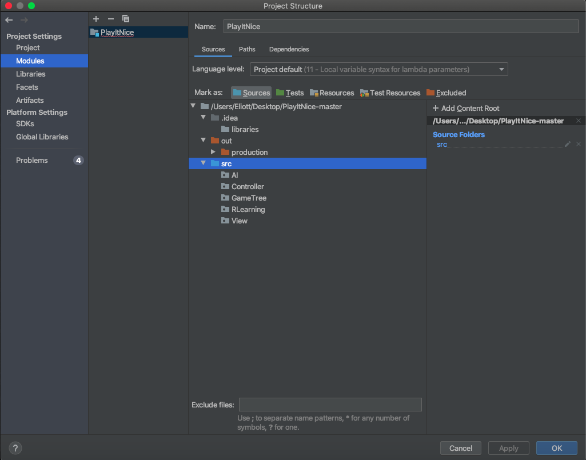

# Play It Nice
## Description 
This project consists in implementing the well-known game Dots-and-Boxes as well as some techniques to solve it. It is entirely 
implemented in Java, using the JavaFX library for the rendering.
## Run the code
IntelliJ is required to compile the code. Make sure to set the SDK to Java 11, to avoid JavaFX exceptions. In the project structures,
more precisely in the 'modules' section, set the \textbf{src} directory as the source path as follows:  

